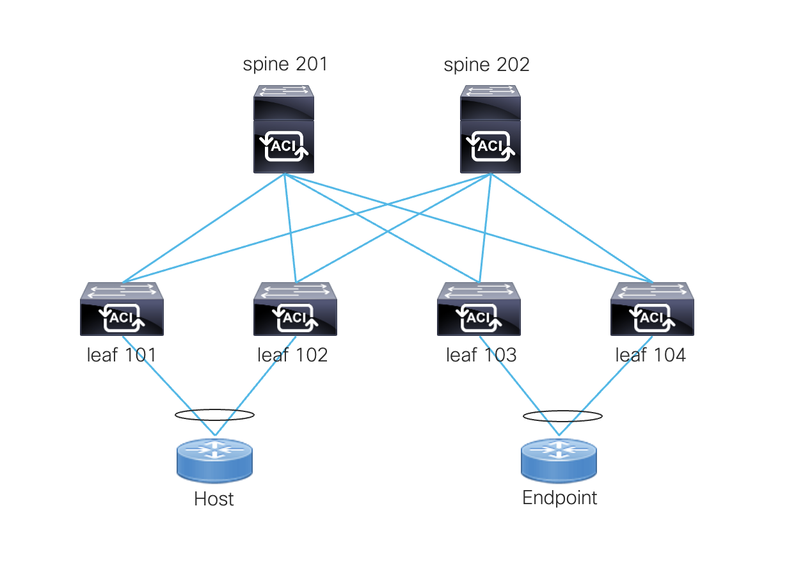
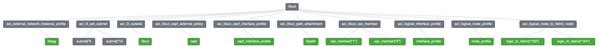

# Terraform with Cisco ACI Demo
This ACI configuration uses Terraform to create a tenant, VRF, bridge domain, application profile, EPG, L3Out and contract to enable communication between a host and a L3Out across an ACI fabric. In the topology, traffic flows from the "host" to the L3Out "endpoint" through 2 VPCs and spine switches. This configuration showcases Terraform variables, looping and modules. 
<p align="center">

</p>

## ACI Tenant Object Hierarchy
```
Tenant                            | aci_tenant
|_ AP                             | aci_application_profile
  |_ EPG                          | aci_application_epg
    | Physical Domain             | aci_epg_to_domain
    | Static Ports                | aci_epg_to_static_path
    | Provided Contract           | aci_epg_to_contract
                                  |
|_ Bridge Domain                  | aci_bridge_domain
  | Subnet (public)               | aci_subnet
  | L3Out                         | aci_bridge_domain
                                  |
| VRF                             | aci_vrf
                                  |
|_ L3Out (OSPF)                   | aci_l3outside
  |_ Logical Node Profile         | aci_logical_node_profile
    | Logical Interface Profile   | aci_logical_interface_profile
  |_ External EPG                 | aci_external_network_instance_profile
    | Subnets                     | aci_l3_ext_subnet
    | Consumed Contract           | aci_external_network_instance_profile
  |_ OSPF Configuration           | aci_l3out_ospf_external_policy, aci_l3out_ospf_interface_profile,      
                                  | aci_logical_node_to_fabric_node, aci_l3out_path_attachment, aci_l3out_vpc_member
```

## Terraform Resource Graph
<p align="center">

</p>

## L3Out Module Graph
<p align="center">

</p>

## Usage
This demo has been tested with Terraform version 1.3.1 and Cisco ACI provider version 2.6.1

To run the demo, first download the code and change host parameters to your environment. 
```
terraform init
terraform plan
terraform apply
```

To undeploy configuration, 
```
terraform destroy
```